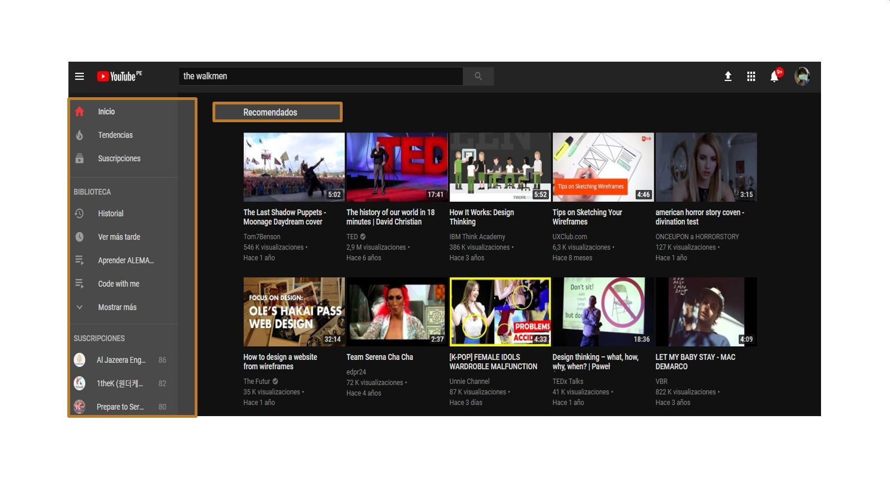
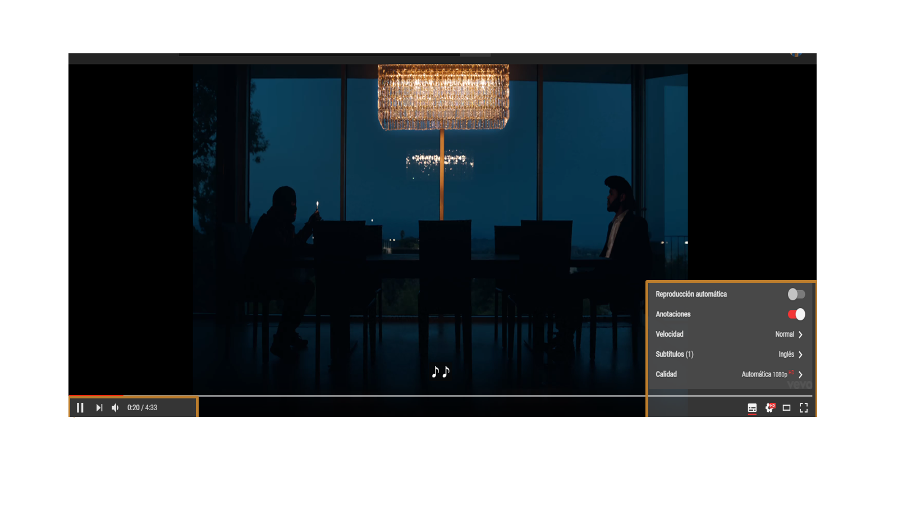
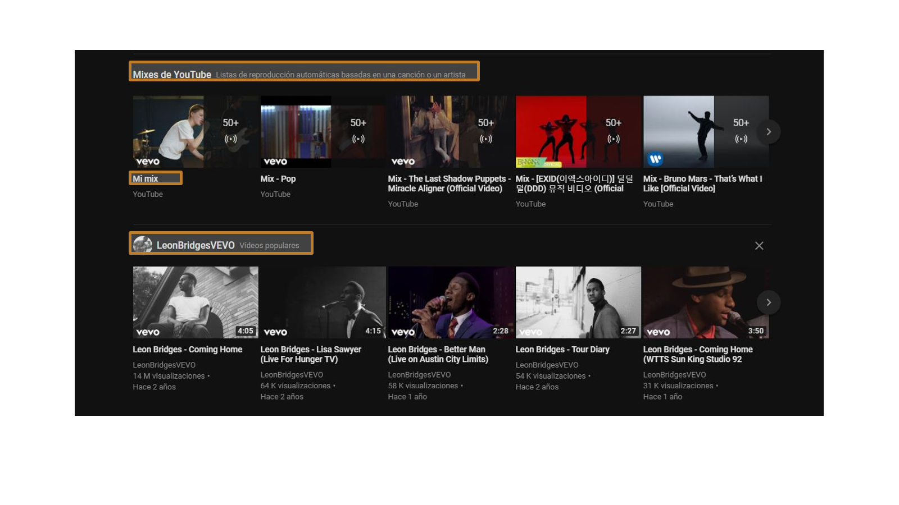
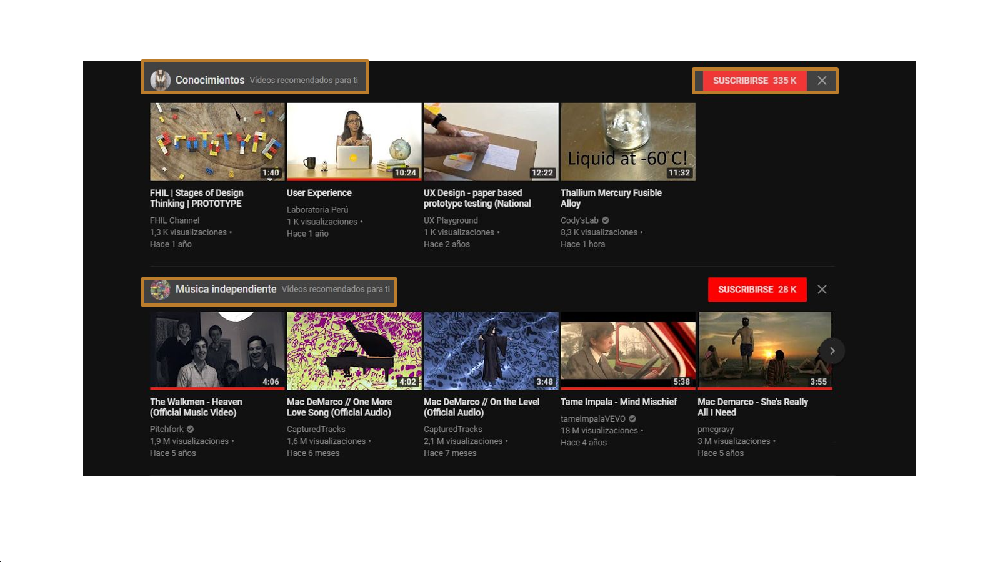
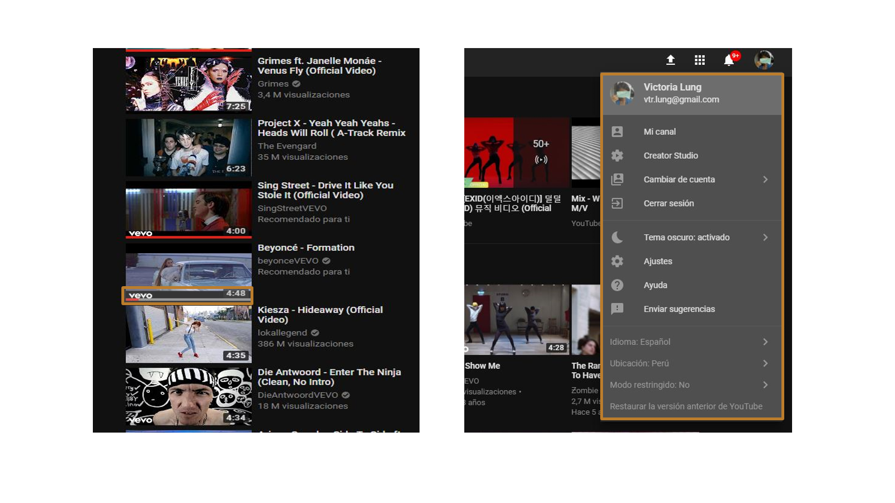
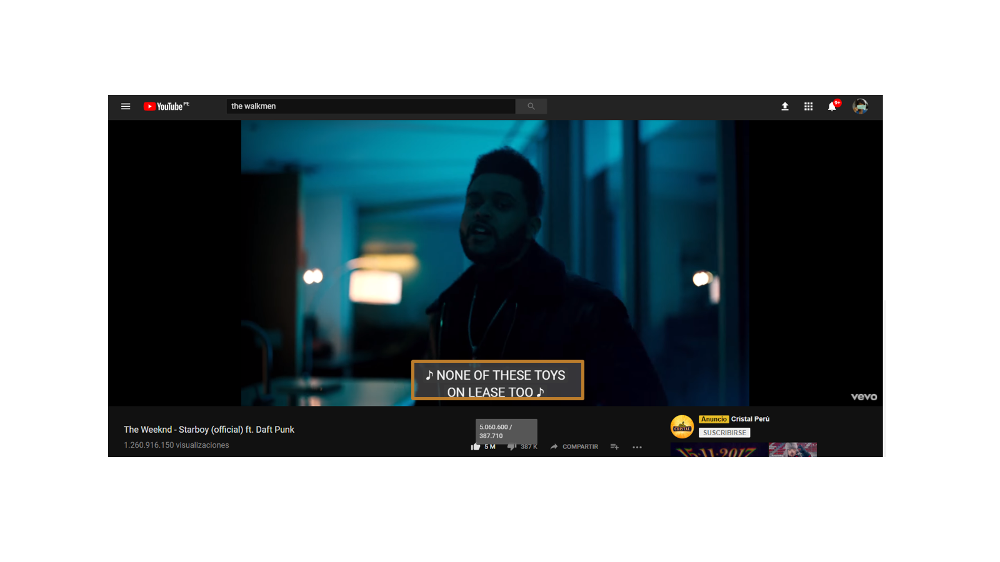

# UX/UI Challenge

* **Track:** _Common Core_
* **Curso:** _Creando un sitio web interactivo con JavaScript_
* **Unidad:** _Intro a User Experience Design_

***
## Objetivo

Elige una web de tu preferencia y explica qué partes conforman el UX y que partes el UI

##  Caso: Youtube

| UX | UI |
|--------|--------|
| Poner pausa y seguir en cualquier dispositivo, pero no continua el video en donde se dejo en el dispositivo anterior|  Diseño de los botones|
| Permite crear mi propio canal ,listas de reproducciòn a partir de videos favoritos y reproducirlos de forma automática| Iconos en gris y blanco|
| Que pueda buscar rápidamente el video que quiero y filtrar mediante distintos rankings|  Los colores de la marca (negro ,blanco y rojo )|
| Que pueda escoger el tipo de velocidad de reproducciòn de video, subtitulos, calidad |  Barra de play en hover con botones para adelantar,volumen,subtítulos, anotaciones,resolución y modo de pantalla|
| Permite escoger el tipo de velocidad de reproducciòn de video, subtitulos, calidad | Barra de avance en el consumo del contenido del video
| Que pueda ver la previzualización de los videos en miniatura|Barra de menu lateral flotante
| Que permita escoger los modos de pantalla(default,teatro,television, pantalla completa)|Imagenes de los videos  con efecto hover donde se pueda previzualizar los videos en miniatura
|Permite escoger tema oscuro y claros para regular la iluminacion | Tipo de temas (zonas claras y zonas oscuras)

- Lo señalado en la tabla de diferencia se muestra en la siguientes imagenes :

   > UX : Recomienda videos o canales basados en mi historial / UI : Los colores de la marca (negro ,blanco y rojo ) y barra de menu lateral flotante

   > UX : Permite escoger el tipo de velocidad de reproducciòn de video, subtitulos, calidad / UI :Barra de play en hover con botones para adelantar,volumen,subtítulos, anotaciones,resolución y modo de pantalla

  > UX:Permite crear mi propio canal ,listas de reproducciòn a partir de videos favoritos y reproducirlos de forma automática / UI:Iconos en gris y blanco

  > UX:Recomienda videos o canales basados en mi historial / UI:Diseño de los botones

  > UX:Permite escoger tema oscuro y claros para regular la iluminacion / UI:Tipo de temas (zonas claras y zonas oscuras)

  > UX:Que permita escoger los modos de pantalla(default,teatro,television, pantalla completa) / UI:Iconos en gris y blanco

